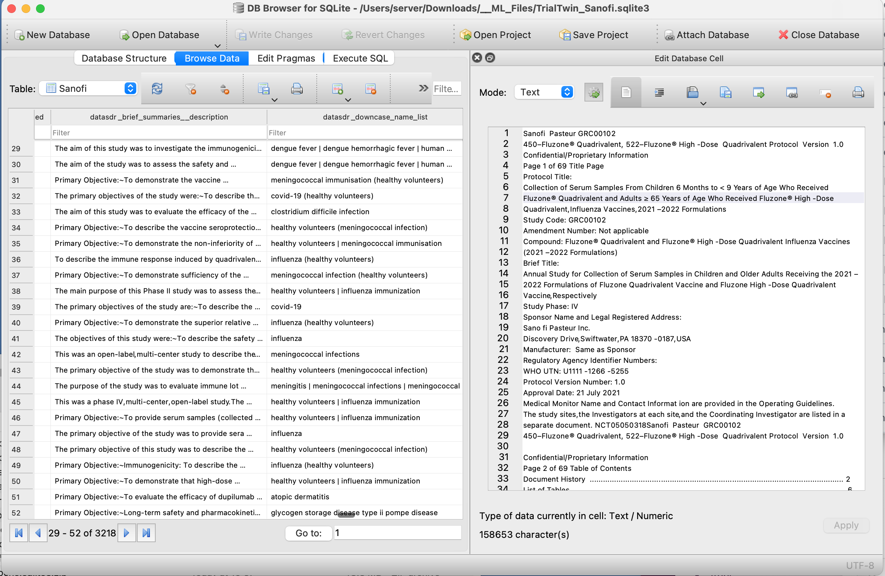

# Running Clinical Trial-specific LLMs Locally

Please download this PDF file with detailed instructions to run your own LLMs locally:

[Teach Yourself to Run LLMs (Large Language Models) in your local computer. Free.](./TrialTwin_Local_LLM.pdf)

This repository contains details, code, and sample data to help you learn how to build clinical trial-specific [Large Language Models ("LLM")](https://en.wikipedia.org/wiki/Large_language_model). 
Then you will be able to run the LLM in your local computer.

This work is done in collaboration with [Jan Philip Göpfert](https://www.linkedin.com/in/jangop/)

## PHUSE SDE presentation, May 30 2024.

This presentation provides context to the materials in this repository.

"Clinical trial-specific LLM to auto-generate Protocols and SAPs."
("SAP" stands for Staatistical Analysis Plan).
Here's the full [presentation file](./TrialTwin_06.pdf) for download.

Summry:
"TrialTwin is building a software platform with Natural Language Generation (“NLG”) capabilities using Natural Language Processing (“NLP”) and other software-driven linguistic processors. Our platform will programmatically extract (and encode) both meaning and context from massive amounts of Open Data into a Domain-specific Large Language Model (“LLM”). Our LLM will then be able to programmatically generate highly-realistic and domain- specific new content.
Build your own trial-specific LLM, here are the pieces."

## Python Code

[Tuesday 04 June 2024]
The Python files will be posted this week.

Please download the PDF file at the top of this file for detailed instructions.

[Tutorial_01.py](./Tutorial_01.py)

[Tutorial_02.py](./Tutorial_02.py)

## Sample Data

You can download sample Open Data to use with the LLMs. The Open Data comes from 02 US government sources:
* ClinicalTrials.gov
* Food and Drug Administration

### ClinicalTrials.gov

The [ClinicalTrials.gov](https://clinicaltrials.gov/) website provides information about 400,000 clinical trials worldwide.

These files include sample PDFs downloaded from ClinicalTrials.gov:
* [10 actual PDFs](./ClinicalTrials_gov_10_PDFs.zip) 
* [Pre-generated indices for those 10 PDFs](./ClinicalTrials_gov_10_PDFs__index.zip) for the 10 PDFs.

100_CT_gov.zip

Download the free, multi-OS [DB Browser for SQLite](https://sqlitebrowser.org/) to open and query SQLite3 database files.

| Sponsor              | Download SQLite3 file                                  |  
| :------------------- | :----------------------------------------------------- |
| Abbott               | [04 MB](./TrialTwin_Abbott.sqlite3.zip)				|
| Abbvie               | [08.2 MB](./TrialTwin_Abbvie.sqlite3.zip)|				|
| AstraZeneca          | [17.4 MB](./TrialTwin_AstraZeneca.sqlite3.zip)         |
| Bayer                | [06.1 MB](./TrialTwin_Bayer.sqlite3.zip)               |
| Bristol Myers Squibb | [16.5 MB](./TrialTwin_Bristol_Myers_Squibb.sqlite3.zip)|
| Johnson & Johnson    | [04.2 MB](./TrialTwin_Johnson_Johnson.sqlite3.zip)     |
| Pfizer               | [18.4 MB](./TrialTwin_Pfizer.sqlite3.zip)              |
| Roche                | [18.3 MB](./TrialTwin_Roche.sqlite3.zip)               |
| Sanofi               | [09.8 MB](./TrialTwin_Sanofi.sqlite3.zip)             |

**Table 1:** SQLite3 files

### Drugs@FDA

The [Drugs@FDA](./https://www.fda.gov/drugs/drug-approvals-and-databases/about-drugsfda) website "..includes most of the drug products approved since 1939. The majority of patient information, labels, approval letters, reviews, and other information are available for drug products approved since 1998."

Here you can download pre-generated index files for [100 records](./100_Drugs_FDA.zip) and [500 records](./500_Drugs_FDA.zip) of the Drugs@FDA dataset.

## Contact Me
José C. Lacal <Jose@Lacal.net> for any questions or suggestiosn for improvement.

Connect with me and follow me in [LinkedIn](https://www.linkedin.com/in/jclacal/)

### Support our work!
We help companies in Life Sciences to accelerate their data management processes.

Please take a look at our [capabilities](./TrialTwin.pdf).
